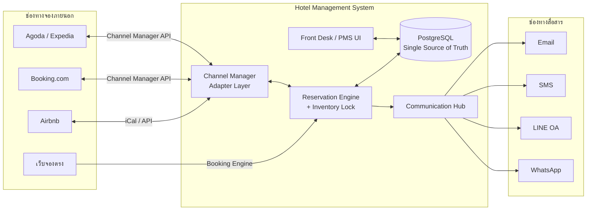

# 🏨 Hotel Management System (HMS)

ระบบบริหารจัดการห้องพักระดับมืออาชีพ ที่เชื่อมข้อมูลจากช่องทางจองออนไลน์ (Airbnb, Booking.com, Agoda ฯลฯ)
แบบอัตโนมัติ พร้อมระบบป้องกัน Overbooking และระบบสื่อสารลูกค้าครบวงจร

> **สถานะโปรเจกต์:** 📄 Design Phase — เอกสารออกแบบสถาปัตยกรรม (ก่อนเริ่มเขียนโค้ด MVP)

---

## 🎯 เป้าหมายหลักของระบบ

| ด้าน | สิ่งที่ระบบต้องทำได้ |
|------|----------------------|
| **Channel Sync** | เชื่อม OTA อัตโนมัติสองทาง — ดึงการจองเข้า + ส่งห้องว่าง/ราคาออก |
| **Anti-Overbooking** | Inventory กลางแหล่งเดียว (single source of truth) + กันจองชนแบบเรียลไทม์ |
| **Communication** | สื่อสารลูกค้าอัตโนมัติตลอด journey ผ่าน Email / SMS / LINE / WhatsApp |
| **Operations** | เช็คอิน-เอาต์, แม่บ้าน, บิล, รายงาน สำหรับพนักงานหน้าบ้าน |

---

## 🧱 Tech Stack (สรุป)

- **Frontend:** Next.js (App Router) + React + TypeScript + Tailwind CSS
- **Backend:** Node.js + TypeScript (NestJS) — REST API + Webhooks
- **Database:** PostgreSQL (row-level locking สำหรับ inventory)
- **Queue/Cache:** Redis + BullMQ (งาน sync, retry, ตั้งเวลาส่งข้อความ)
- **Real-time:** WebSocket / SSE (อัปเดตปฏิทินสด)
- **Integrations:** iCal, Channel Manager (Channex/Beds24), Payment (Omise/Stripe), Messaging APIs

---

## 📚 สารบัญเอกสารออกแบบ

อ่านตามลำดับนี้เพื่อเข้าใจภาพรวม → รายละเอียด:

| # | เอกสาร | เนื้อหา |
|---|--------|---------|
| 01 | [สถาปัตยกรรมระบบ](docs/01-architecture.md) | ภาพรวม components, tech stack, data flow, การ deploy |
| 02 | [Data Model & Schema](docs/02-data-model.md) | ER diagram, ตารางหลัก, คำอธิบายทุก entity |
| 03 | [ระบบป้องกัน Overbooking](docs/03-anti-overbooking.md) | หลักการ inventory, locking, concurrency, idempotency |
| 04 | [เชื่อมช่องทาง OTA](docs/04-channel-integration.md) | iCal + Channel Manager, mapping, sync engine |
| 05 | [ระบบสื่อสารลูกค้า](docs/05-communication-hub.md) | Message timeline, channels, templates, automation |
| 06 | [Roadmap & MVP](docs/06-roadmap.md) | เฟสการพัฒนา, ขอบเขต MVP, ลำดับความสำคัญ |

**ไฟล์ประกอบ:**
- [`db/schema.sql`](db/schema.sql) — PostgreSQL DDL พร้อมใช้ (สร้างตารางจริงได้เลย)

---

## 🗺️ ภาพรวมสถาปัตยกรรม (1 ภาพ)

---

## ▶️ ขั้นตอนถัดไป

1. ✅ **เอกสารออกแบบ** (เอกสารชุดนี้)
2. ⬜ Review & ปรับแก้ตาม feedback
3. ⬜ เริ่ม **MVP**: Core PMS + ปฏิทินห้องว่าง + จอง + กัน overbooking + iCal sync
4. ⬜ เพิ่ม Communication Hub + Channel Manager API
