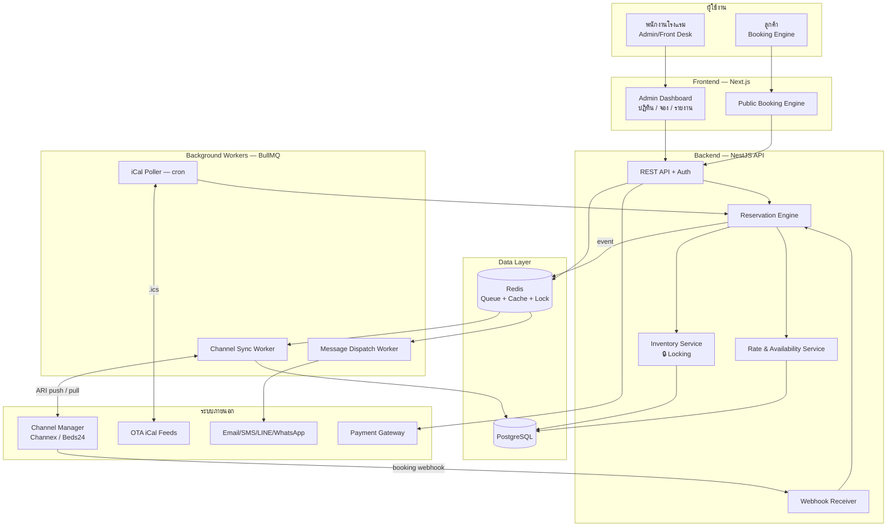
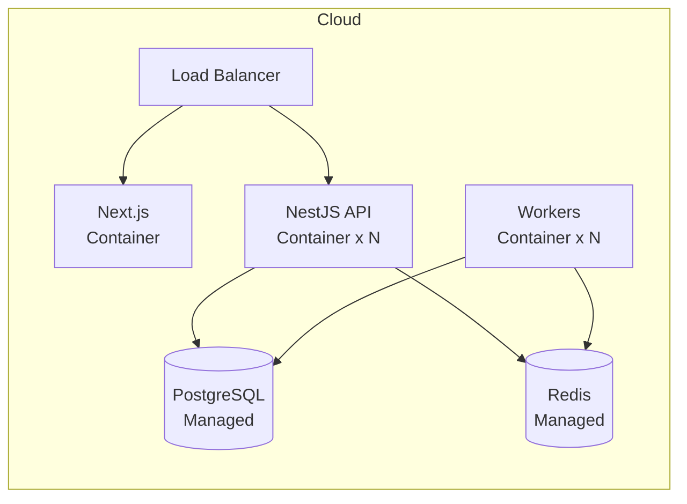

# 01 · สถาปัตยกรรมระบบ (System Architecture)

เอกสารนี้อธิบายภาพรวมของ components, การไหลของข้อมูล และเหตุผลของการเลือกเทคโนโลยี

---

## 1. หลักการออกแบบ (Design Principles)

1. **Single Source of Truth** — สต็อกห้อง (inventory) มีที่เก็บเดียวคือฐานข้อมูลกลาง ทุกช่องทางอ่าน/เขียนผ่านที่นี่เท่านั้น → เป็นหัวใจของการกัน overbooking
2. **Channel-Agnostic Core** — แกนกลางไม่รู้จัก Airbnb/Booking โดยตรง แต่คุยผ่าน **Adapter** มาตรฐาน → เพิ่ม/เปลี่ยนช่องทางได้โดยไม่แตะ core
3. **Event-Driven** — ทุกเหตุการณ์สำคัญ (จองใหม่, ยกเลิก, เช็คอิน) ปล่อย event → ระบบอื่น (sync, สื่อสาร, รายงาน) subscribe เอง → ลด coupling
4. **Idempotency ทุกจุดที่รับข้อมูลนอก** — กันข้อมูลซ้ำจาก webhook/retry
5. **Async ทุกงานที่ช้าหรือพลาดได้** — การ sync กับ OTA และส่งข้อความ ทำผ่านคิว + retry ไม่บล็อกการจอง

---

## 2. Component Diagram



---

## 3. คำอธิบายแต่ละชั้น (Layers)

### 3.1 Frontend (Next.js + TypeScript)
- **Admin Dashboard** — ปฏิทินห้องพัก (drag-drop), จัดการจอง, ราคา, แม่บ้าน, รายงาน
- **Booking Engine** — หน้าเว็บให้ลูกค้าจองตรง (ไม่เสียค่าคอมฯ OTA)
- ใช้ **Server Components** สำหรับหน้าโหลดข้อมูลหนัก + **WebSocket/SSE** สำหรับอัปเดตปฏิทินสด

### 3.2 Backend API (NestJS)
- **REST API** — CRUD ทุก resource + auth (JWT + RBAC)
- **Reservation Engine** — สมองของการจอง: ตรวจห้องว่าง → ล็อก → สร้าง booking → ปล่อย event
- **Inventory Service** — จัดการสต็อกระดับ `room_type × วันที่` พร้อม locking (ดู [เอกสาร 03](03-anti-overbooking.md))
- **Webhook Receiver** — รับ booking ใหม่จาก Channel Manager แบบเรียลไทม์

### 3.3 Background Workers (BullMQ บน Redis)
งานที่ต้อง async + retry ได้:
- **Channel Sync Worker** — push ห้องว่าง/ราคาไป OTA เมื่อ inventory เปลี่ยน
- **iCal Poller** — cron ดึงไฟล์ `.ics` จาก OTA ทุก N นาที (ทางเลือกไม่มี Channel Manager)
- **Message Dispatch Worker** — ส่งข้อความตาม schedule (ดู [เอกสาร 05](05-communication-hub.md))

### 3.4 Data Layer
- **PostgreSQL** — ข้อมูลหลักทั้งหมด + transaction/locking ที่แข็งแรง
- **Redis** — คิวงาน (BullMQ), cache, และ **distributed lock** สำหรับ sync

---

## 4. Data Flow สำคัญ 3 กรณี

### กรณี A: ลูกค้าจองผ่าน Booking.com
```
Booking.com → Channel Manager → Webhook → Reservation Engine
   → ตรวจ+ล็อก inventory → สร้าง reservation → ปล่อย event "reservation.created"
   → [Sync Worker] push ห้องว่างที่ลดลงไปทุก OTA
   → [Message Worker] ส่งอีเมลยืนยันให้ลูกค้า
```

### กรณี B: ลูกค้าจองตรงผ่านเว็บเรา
```
Booking Engine → API → Reservation Engine → ล็อก inventory → reservation
   → event → Sync Worker ตัดห้องว่างจาก OTA ทั้งหมด (กัน overbooking!)
```

### กรณี C: พนักงานปิดขายห้อง (maintenance)
```
Admin UI → Inventory Service ตั้ง stop-sell วันนั้น
   → event → Sync Worker แจ้ง OTA ทุกช่องทางว่าเต็ม
```

> **จุดสำคัญ:** ทุกกรณีผ่าน **Inventory Service จุดเดียว** → ไม่มีทางที่สองช่องทางจะขายห้องสุดท้ายพร้อมกันได้

---

## 5. การ Deploy (แนะนำ)



- **Containerized** (Docker) — deploy ที่ไหนก็ได้ (Railway, Render, AWS, GCP, DigitalOcean)
- **Managed PostgreSQL + Redis** — ลดภาระ ops, ได้ backup อัตโนมัติ
- **API และ Workers แยก scale ได้อิสระ** — ช่วง high season เพิ่ม worker ได้โดยไม่กระทบ API

---

## 6. Security & Compliance (ย่อ)

- **Auth:** JWT + Refresh token, RBAC (Owner / Manager / Front Desk / Housekeeping)
- **PII:** เข้ารหัสข้อมูลลูกค้าที่ระดับ column ที่อ่อนไหว (เลขบัตร/พาสปอร์ต), mask ใน log
- **PCI:** ❌ ไม่เก็บเลขบัตรเครดิตเอง → ใช้ tokenization ของ Payment Gateway (Omise/Stripe)
- **Audit Log:** บันทึกทุกการเปลี่ยนแปลง booking/inventory (ใครทำ, เมื่อไหร่, ค่าเก่า→ใหม่)
- **PDPA (ไทย):** เก็บ consent การสื่อสาร, มีช่องทาง opt-out, กำหนดอายุการเก็บข้อมูล

---

➡️ ถัดไป: [02 · Data Model & Schema](02-data-model.md)
