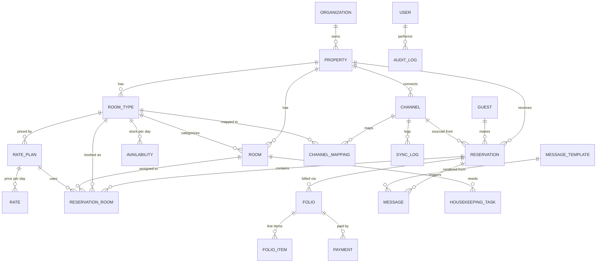
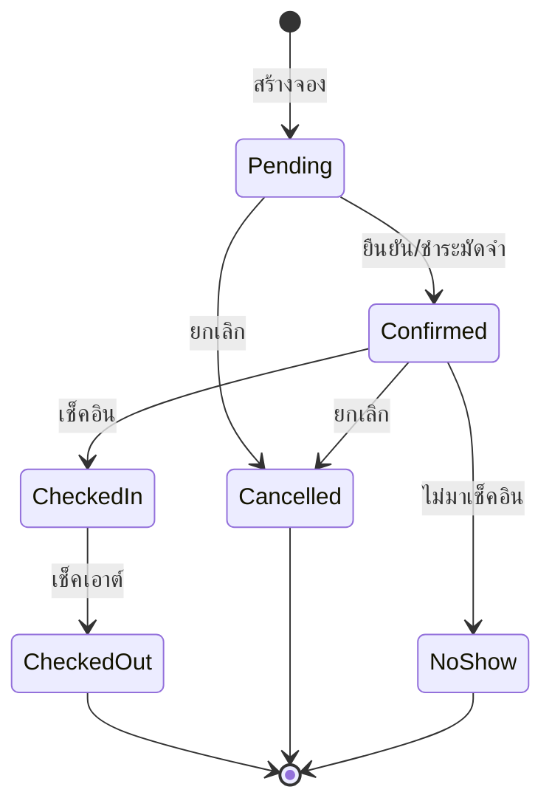

# 02 · Data Model & Schema

หัวใจของระบบอยู่ที่ **โมเดลข้อมูล** — โดยเฉพาะการแยก "ประเภทห้อง" ออกจาก "ห้องจริง" และการเก็บ
inventory ระดับวัน ซึ่งเป็นรากฐานของการกัน overbooking

> DDL พร้อมรันจริงอยู่ที่ [`db/schema.sql`](../db/schema.sql)

---

## 1. แนวคิดหลักที่ต้องเข้าใจก่อน

### 🔑 แยก Room Type ↔ Room (Unit)
โรงแรมส่วนใหญ่**ขาย "ประเภทห้อง" ไม่ใช่ห้องเจาะจง** เช่น ลูกค้าจอง "Deluxe" 1 คืน แต่จะได้ห้อง 301
หรือ 305 ค่อยกำหนดตอนเช็คอิน แนวคิดนี้ทำให้:
- ขายได้ยืดหยุ่น (มี Deluxe ว่าง 5 ห้อง = ขายได้ 5 การจอง)
- ย้ายห้องได้โดยไม่กระทบการจอง
- OTA ก็ทำงานแบบนี้ (map เข้ากับ room_type)

### 🔑 Inventory เก็บระดับ `room_type × วันที่`
ตาราง `availability` เก็บ **จำนวนห้องที่ขายได้ในแต่ละวัน** ต่อประเภทห้อง — ไม่ใช่คำนวณสดทุกครั้ง
→ อ่านเร็ว, ล็อกได้แม่นยำ, sync กับ OTA ตรงไปตรงมา (ดูรายละเอียด [เอกสาร 03](03-anti-overbooking.md))

---

## 2. ER Diagram

---

## 3. คำอธิบาย Entity หลัก

### กลุ่ม A — โครงสร้างที่พัก (Property Structure)

| Entity | หน้าที่ | หมายเหตุ |
|--------|---------|----------|
| `organization` | เจ้าของ/เชนโรงแรม (รองรับหลาย property) | multi-tenant ตั้งแต่ต้น |
| `property` | โรงแรม/ที่พัก 1 แห่ง | timezone, currency, นโยบายเช็คอิน |
| `room_type` | ประเภทห้อง เช่น Deluxe, Suite | occupancy, จำนวนห้องรวม |
| `room` | ห้องจริง เช่น 301 | สถานะ (clean/dirty/OOO) |

### กลุ่ม B — ราคา & สต็อก (Rates & Inventory)

| Entity | หน้าที่ | หมายเหตุ |
|--------|---------|----------|
| `rate_plan` | แผนราคา เช่น "จ่ายเลย -10%", "รวมอาหารเช้า" | เงื่อนไข refundable, min-stay |
| `rate` | ราคาต่อ (room_type × rate_plan × วันที่) | ปรับราคาเป็นรายวันได้ |
| `availability` | **จำนวนห้องขายได้ต่อ (room_type × วันที่)** | 🔒 หัวใจกัน overbooking + stop_sell flag |

### กลุ่ม C — การจอง (Reservations)

| Entity | หน้าที่ | หมายเหตุ |
|--------|---------|----------|
| `guest` | ข้อมูลลูกค้า | PII เข้ารหัส, consent การสื่อสาร |
| `reservation` | 1 การจอง (1 ใบ) | status, ช่องทางที่มา, ยอดรวม |
| `reservation_room` | 1 บรรทัด = 1 ห้อง × ช่วงวัน | ตัวที่ผูกกับ room_type และตัดสต็อกจริง |

> การแยก `reservation` (ใบจอง) กับ `reservation_room` (รายห้อง) ทำให้ 1 ใบจองมีได้หลายห้อง/หลายคืน
> และตัด inventory ได้ถูกต้องตามแต่ละ room_type × วัน

### กลุ่ม D — ช่องทาง OTA (Channels)

| Entity | หน้าที่ | หมายเหตุ |
|--------|---------|----------|
| `channel` | การเชื่อมต่อ 1 ช่องทาง (Airbnb, Booking...) | ประเภท (ical/channel_manager), credential |
| `channel_mapping` | จับคู่ room_type/rate_plan ของเรา ↔ ของ OTA | external_id ทั้งสองฝั่ง |
| `sync_log` | ประวัติการ sync ทุกครั้ง | สำเร็จ/ล้มเหลว, payload, ใช้ debug |

### กลุ่ม E — การเงิน (Billing)

| Entity | หน้าที่ |
|--------|---------|
| `folio` | บัญชีค่าใช้จ่ายของการจอง (ห้อง + extra) |
| `folio_item` | รายการย่อย (ค่าห้อง, มินิบาร์, ค่าปรับ) |
| `payment` | การชำระ/มัดจำ/คืนเงิน (ผูก gateway token) |

### กลุ่ม F — สื่อสาร & ปฏิบัติการ

| Entity | หน้าที่ |
|--------|---------|
| `message_template` | เทมเพลตข้อความ (หลายภาษา, หลายช่องทาง) |
| `message` | ข้อความที่ส่ง/ตั้งเวลาส่ง ต่อการจอง |
| `housekeeping_task` | งานแม่บ้านต่อห้อง (ทำความสะอาด/ตรวจ) |
| `user` | พนักงาน + role (RBAC) |
| `audit_log` | บันทึกการเปลี่ยนแปลงสำคัญทุกอย่าง |

---

## 4. สถานะ (State Machines) สำคัญ

### Reservation Status

> การเปลี่ยนสถานะเป็น `Cancelled`/`NoShow` จะ **คืนสต็อก** เข้า `availability` และ trigger sync

### Room Housekeeping Status
`Clean → Occupied → Dirty → Cleaning → Inspected → Clean` (+ `Out-of-Order` แยกออกมา)

---

## 5. หลักการตั้ง Index & ประสิทธิภาพ

- `availability (property_id, room_type_id, date)` — **UNIQUE** + เป็น index หลักสำหรับ query ปฏิทิน
- `reservation_room (room_type_id, checkin_date, checkout_date)` — query ช่วงวันที่ทับซ้อน
- `reservation (channel_id, external_ref)` — **UNIQUE** → idempotency กัน booking ซ้ำจาก OTA
- `message (status, scheduled_at)` — worker ดึงงานที่ถึงเวลาส่ง

---

➡️ ถัดไป: [03 · ระบบป้องกัน Overbooking](03-anti-overbooking.md)
