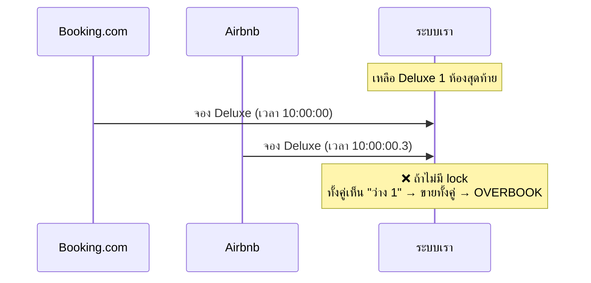
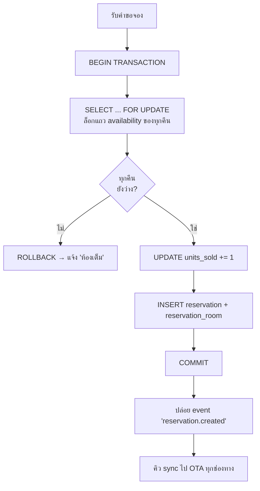
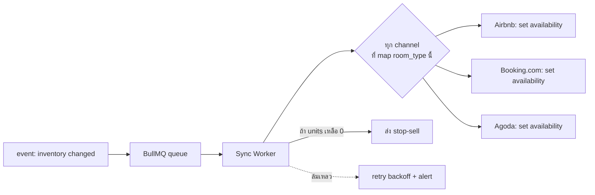

# 03 · ระบบป้องกัน Overbooking

Overbooking เกิดเมื่อ **ขายห้องเกินจำนวนที่มีจริง** — มักเกิดตอนสองช่องทางขายห้องสุดท้ายพร้อมกัน
ก่อน sync ทัน เอกสารนี้อธิบายกลไกกัน overbooking ตั้งแต่ระดับฐานข้อมูลจนถึงการ sync กับ OTA

---

## 1. รากของปัญหา (ทำไมถึงเกิด)



**3 สาเหตุหลัก:**
1. **Race condition** — สองคำขอตัดสต็อกพร้อมกัน
2. **Sync delay** — ขายตรงแล้ว แต่ยังไม่ทันบอก OTA ว่าเต็ม
3. **ข้อมูลซ้ำ** — webhook ยิงซ้ำ / retry ทำให้ตัดสต็อกเกิน

ระบบนี้จัดการทั้ง 3 ด้วย 3 ชั้นป้องกัน 👇

---

## 2. ชั้นที่ 1 — Atomic Inventory ที่ระดับฐานข้อมูล

### หลักการ
สต็อกเก็บเป็น **จำนวน (count)** ต่อ `room_type × วันที่` ในตาราง `availability`
การตัดสต็อกใช้ **conditional UPDATE แบบ atomic** — ตัดได้ก็ต่อเมื่อยังมีพอ:

```sql
-- ตัดสต็อก 1 ห้อง สำหรับทุกคืนที่จอง (atomic + ปลอดภัยกับ concurrency)
UPDATE availability
SET units_sold = units_sold + 1
WHERE property_id = $1
  AND room_type_id = $2
  AND date >= $3 AND date < $4      -- ทุกคืน checkin..checkout-1
  AND stop_sell = false
  AND units_sold + 1 <= units_total  -- ⛔ เงื่อนไขกันเกิน
RETURNING date;
```

- ถ้าจำนวนแถวที่ถูกอัปเดต **< จำนวนคืนที่ต้องการ** → มีบางคืนเต็ม → **ยกเลิก transaction ทั้งก้อน** (rollback)
- PostgreSQL รับประกันว่า `UPDATE` แต่ละแถวเป็น atomic → ไม่มีทางที่สอง transaction จะตัดห้องสุดท้ายทั้งคู่

### ทำไมไม่คำนวณสด (count reservations)?
เพราะการนับ booking สดทุกครั้งช้าและเสี่ยง race — การเก็บ `units_sold` ที่ปรับแบบ atomic
พร้อม `CHECK (units_sold <= units_total)` เป็นด่านสุดท้ายที่ฐานข้อมูล **ปฏิเสธ** การเกินเสมอ

---

## 3. ชั้นที่ 2 — Transaction + Locking ใน Reservation Engine

flow การสร้าง booking ทั้งหมดอยู่ใน **transaction เดียว**:



**จุดสำคัญ:**
- `SELECT ... FOR UPDATE` ล็อกแถวของทุกคืนที่จะจอง → คำขออื่นที่แตะคืนเดียวกันต้อง**รอ** จนกว่าจะ commit
- ล็อกเรียงลำดับ `date` เสมอ → กัน **deadlock**
- Event ปล่อย**หลัง** commit เท่านั้น → ไม่มีทาง sync ข้อมูลที่ยังไม่จริง

---

## 4. ชั้นที่ 3 — Idempotency (กันข้อมูลซ้ำจาก OTA)

OTA/Channel Manager อาจยิง webhook เดิมซ้ำ (network retry) ต้องกันสร้าง booking ซ้ำ:

```sql
-- UNIQUE constraint บนคู่ (channel, external reference)
CONSTRAINT uq_channel_ref UNIQUE (channel_id, external_ref)
```

flow การรับ booking จากภายนอก:
```
รับ webhook → ตรวจ (channel_id, external_ref) มีอยู่แล้วไหม?
   ├─ มี   → ตอบ 200 OK เฉยๆ (idempotent, ไม่ทำซ้ำ)
   └─ ไม่มี → เข้า Reservation Engine ปกติ (ชั้น 2)
```

นอกจากนี้ทุก request เขียนควรมี **Idempotency-Key** header สำหรับ API ฝั่งเรา

---

## 5. Sync กับ OTA — ปิดช่องว่างเวลา (Sync Delay)

หลังทุกครั้งที่ inventory เปลี่ยน (จอง/ยกเลิก/ปิดขาย) ระบบ **push ห้องว่างใหม่ไปทุก OTA ทันที**:



**กลยุทธ์ลดความเสี่ยงช่วง sync delay:**
- **Push ทันที** ผ่านคิว (มักเสร็จใน < 1–2 วินาที)
- **Availability buffer (optional)** — กันไว้ 1 ห้องไม่ขายบน OTA สำหรับ property ที่ขายเร็วมาก
- **Retry + backoff** — ถ้า OTA ล่ม ลองซ้ำ + แจ้งเตือนพนักงาน
- **Reconciliation cron** — ทุกคืน เทียบ availability เรากับ OTA ว่าตรงกันไหม → auto-heal

---

## 6. iCal Sync — ข้อจำกัดที่ต้องรู้ (สำคัญมาก)

ถ้าใช้ **iCal** (ทางเลือกฟรี ไม่มี Channel Manager) ต้องเข้าใจข้อจำกัด:

| ประเด็น | iCal | Channel Manager API |
|---------|------|---------------------|
| ความถี่ sync | ทุก ~5–60 นาที (poll) | เรียลไทม์ (push/webhook) |
| ข้อมูลที่ได้ | แค่ **ช่วงวันที่ถูกจอง** | ครบ: ราคา, ชื่อลูกค้า, ยอด |
| ทิศทาง | ต้อง import + export แยกไฟล์ | สองทางในเส้นเดียว |
| ความเสี่ยง overbook | **สูงกว่า** (มี lag) | ต่ำ |

**⚠️ กับ iCal มีช่องว่าง 5–60 นาทีที่ overbooking เกิดได้จริง** — เหมาะกับที่พักเล็ก ห้องน้อย
ทราฟฟิกต่ำ สำหรับที่พักที่ขายเร็ว **แนะนำ Channel Manager API** (ดู [เอกสาร 04](04-channel-integration.md))

มาตรการลดเสี่ยงกับ iCal:
- ตั้ง poll ถี่ที่สุดเท่าที่ OTA ยอม (มัก 5–15 นาที)
- เปิด buffer 1 ห้องบน OTA ที่ขายเร็ว
- Export feed ของเราให้ OTA อ่านทันทีที่จองตรง

---

## 7. Checklist การกัน Overbooking

- [x] Inventory เป็น count ที่ระดับ `room_type × วัน` + `CHECK (units_sold <= units_total)`
- [x] ทุก booking อยู่ใน transaction + `SELECT FOR UPDATE` เรียงตามวัน (กัน deadlock)
- [x] UNIQUE `(channel_id, external_ref)` + Idempotency-Key (กันซ้ำ)
- [x] Push availability ไปทุก OTA ทันทีผ่านคิว + retry
- [x] Reconciliation cron รายวัน (auto-heal ความคลาดเคลื่อน)
- [x] Availability buffer สำหรับ property ที่ขายเร็ว (ปรับได้)
- [x] Alert เมื่อ sync ล้มเหลวเกิน threshold

---

➡️ ถัดไป: [04 · เชื่อมช่องทาง OTA](04-channel-integration.md)
