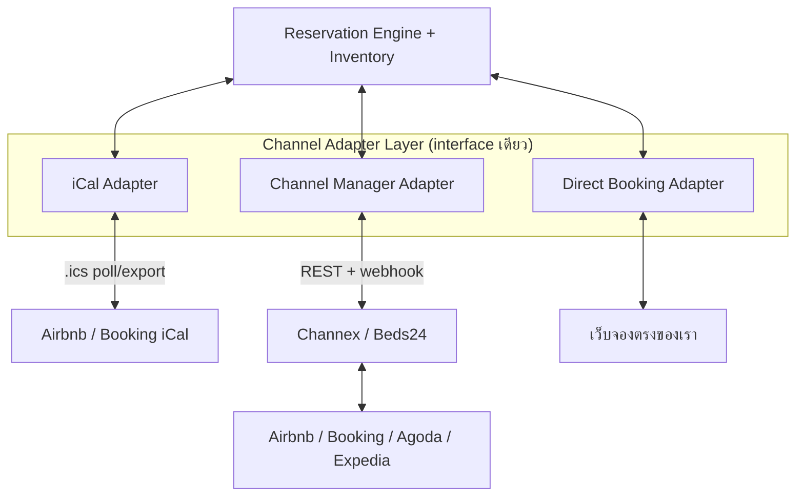
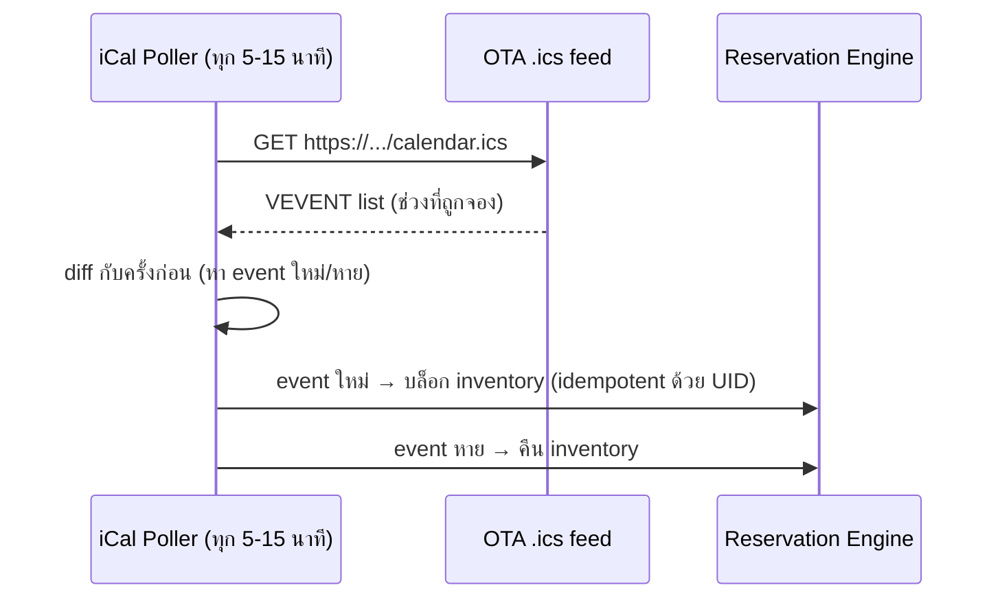
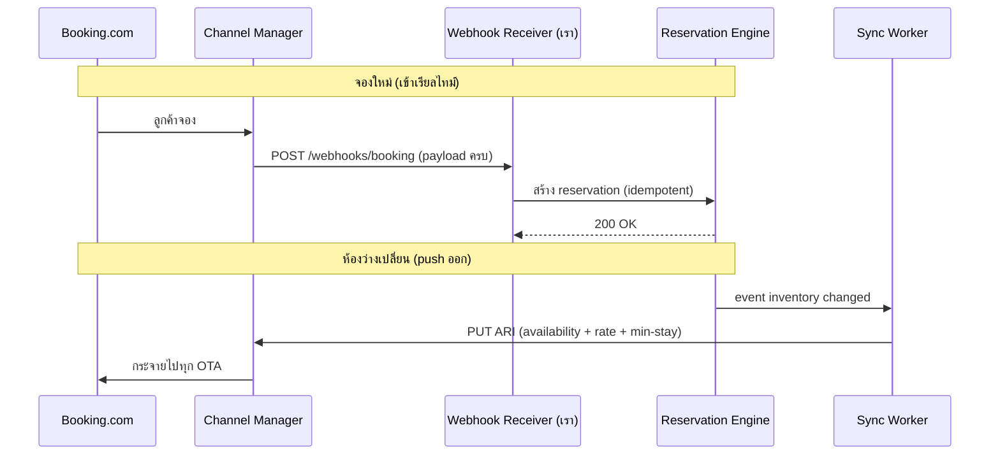

# 04 · เชื่อมช่องทาง OTA (Channel Integration)

ออกแบบ **เผื่อทั้งสองแนวทาง** ตามที่ตกลง — เริ่มด้วย **iCal** (ฟรี, เร็ว) แล้วค่อยเสียบ
**Channel Manager API** (ครบ, เรียลไทม์) โดยไม่ต้องรื้อ core เพราะทั้งคู่ทำงานผ่าน **Adapter interface เดียวกัน**

---

## 1. ความจริงที่ต้องรู้ก่อน (สำคัญ)

> 🔴 **Airbnb และ Booking.com ไม่เปิด API ตรงให้ที่พักรายเล็ก** — ต้องเป็น partner ที่ผ่านการรับรอง
> หรือมีจำนวนห้องถึงเกณฑ์ ในทางปฏิบัติมี 2 เส้นทางที่ทำได้จริง:

| เส้นทาง | ได้อะไร | ต้นทุน | เหมาะกับใคร |
|---------|---------|--------|-------------|
| **iCal Sync** | เฉพาะช่วงวันที่ถูกจอง (ว่าง/ไม่ว่าง) | ฟรี | ที่พักเล็ก, ห้องน้อย |
| **Channel Manager** (Channex, Beds24, SiteMinder) | ARI ครบ + รายละเอียดการจอง + ชื่อลูกค้า แบบเรียลไทม์ | รายเดือน (~หลักร้อย–พันบาท) | ที่พักที่จริงจัง |

ระบบเราจึง **ไม่คุยกับ OTA ตรง** แต่คุยผ่าน 2 อะแดปเตอร์นี้ → เปลี่ยน/เพิ่มได้อิสระ

---

## 2. Adapter Pattern — หัวใจของการออกแบบเผื่อ



ทุก adapter implement interface เดียวกัน — core เรียกใช้เหมือนกันหมด:

```typescript
interface ChannelAdapter {
  // ดึงการจองใหม่จากช่องทาง → ป้อนเข้า Reservation Engine
  pullReservations(since: Date): Promise<InboundReservation[]>;

  // ส่งห้องว่าง/ราคา/min-stay ออกไปช่องทาง (ARI push)
  pushAvailability(updates: AvailabilityUpdate[]): Promise<SyncResult>;
  pushRates(updates: RateUpdate[]): Promise<SyncResult>;

  // ปิดการขาย (stop-sell) เมื่อห้องเต็ม
  pushStopSell(roomTypeId: string, dates: DateRange): Promise<SyncResult>;
}
```

> 💡 เพิ่ม Airbnb/Agoda/ช่องทางใหม่ = เขียน adapter ใหม่ 1 ตัว **โดยไม่แตะ Reservation Engine เลย**

---

## 3. แนวทาง A — iCal Sync (เริ่มต้น, ฟรี)

### 3.1 Import (ดึงการจองจาก OTA เข้าเรา)

- ใช้ `VEVENT.UID` เป็น `external_ref` → **idempotent** (ดึงซ้ำไม่ตัดสต็อกซ้ำ)
- iCal บอกแค่ "วันนี้ถูกจอง" ไม่มีชื่อลูกค้า/ราคา → สร้าง reservation แบบ `source=ical` มีข้อมูลเท่าที่มี

### 3.2 Export (ให้ OTA เห็นว่าเราจองตรงแล้ว)
- ระบบสร้าง feed `.ics` ต่อ room_type ให้ OTA มา subscribe
- ทันทีที่จองตรง/จองจากช่องอื่น → feed อัปเดต → OTA poll เห็นว่าเต็ม
- ⚠️ ขึ้นกับความถี่ที่ OTA poll (เราคุมไม่ได้) → นี่คือที่มาของ sync delay

---

## 4. แนวทาง B — Channel Manager API (ครบ, เรียลไทม์)

ใช้ผู้ให้บริการ Channel Manager เป็นตัวกลางคุยกับทุก OTA:



**ผู้ให้บริการแนะนำ** (เรียงตามความ dev-friendly):
- **Channex.io** — API-first, docs ดี, เหมาะ integrate เอง, มี sandbox
- **Beds24** — ยืดหยุ่นสูง, ราคาถูก, API ครบ
- **SiteMinder / Cloudbeds** — enterprise, ครอบคลุม OTA เยอะสุด

> การมี Adapter layer ทำให้เลือกเจ้าไหนก็ได้ และย้ายเจ้าได้ภายหลังโดยแก้แค่ 1 adapter

---

## 5. Channel Mapping — จับคู่ห้องเรา ↔ ห้อง OTA

ก่อน sync ได้ ต้อง map ให้ระบบรู้ว่า "Deluxe ของเรา = room id 88231 บน Booking.com":

```
channel_mapping:
  channel_id      → Booking.com connection
  room_type_id    → Deluxe (ภายในเรา)
  rate_plan_id    → "รวมอาหารเช้า" (ภายในเรา)
  external_room_id   → "88231"        (ฝั่ง OTA)
  external_rate_id   → "STD-BB"       (ฝั่ง OTA)
```

- ทำครั้งเดียวตอน onboard property
- มี UI ให้พนักงาน map แบบ dropdown (ดึง room list จาก OTA มาให้เลือก)
- ทุก sync อ้าง mapping นี้ → รู้ว่าจะยิงค่าไป room/rate ไหนของ OTA

---

## 6. อะไร sync บ้าง (ARI)

**ARI = Availability, Rates, Inventory** — 3 อย่างที่ต้อง sync สองทาง:

| ข้อมูล | ทิศทาง | trigger |
|--------|--------|---------|
| **Availability** (ห้องว่างต่อวัน) | เรา → OTA | ทุกครั้งที่ inventory เปลี่ยน |
| **Rates** (ราคาต่อวัน) | เรา → OTA | เมื่อแก้ราคา |
| **Restrictions** (min-stay, stop-sell, CTA/CTD) | เรา → OTA | เมื่อตั้งเงื่อนไข |
| **Reservations** (การจองใหม่/ยกเลิก) | OTA → เรา | เรียลไทม์ (webhook) / poll (iCal) |

---

## 7. การจัดการความผิดพลาด (Resilience)

- **ทุกงาน sync ผ่าน BullMQ** — retry อัตโนมัติแบบ exponential backoff
- **Dead-letter queue** — งานที่ fail เกิน N ครั้ง เก็บไว้ + แจ้งเตือน admin
- **sync_log** ทุกครั้ง — เก็บ request/response ไว้ debug และ audit
- **Circuit breaker** — ถ้า OTA ล่มต่อเนื่อง หยุดยิงชั่วคราว กัน flood
- **Nightly reconciliation** — cron เทียบ availability เรา ↔ OTA, รายงานส่วนต่าง + auto-heal

---

## 8. ลำดับการทำ (แนะนำ)

1. **Phase 1:** Direct Booking Adapter + iCal Adapter (import/export) → ใช้งานได้จริง ฟรี
2. **Phase 2:** เสียบ Channel Manager Adapter (Channex) → เรียลไทม์ + ข้อมูลครบ
3. **Phase 3:** Reconciliation + monitoring dashboard สำหรับ sync health

---

➡️ ถัดไป: [05 · ระบบสื่อสารลูกค้า](05-communication-hub.md)
