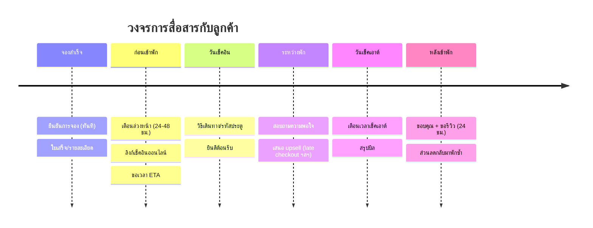
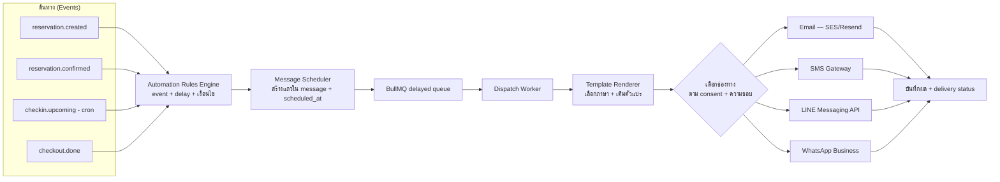

# 05 · ระบบสื่อสารลูกค้าครบวงจร (Communication Hub)

สื่อสารกับลูกค้า **อัตโนมัติตลอด journey** — ตั้งแต่จองจนถึงหลังเช็คเอาต์ — ผ่านหลายช่องทาง
(Email / SMS / LINE OA / WhatsApp) ด้วยเทมเพลตหลายภาษา และ trigger ตามเหตุการณ์

---

## 1. Timeline การสื่อสาร (Guest Journey)



---

## 2. สถาปัตยกรรม Communication Hub



---

## 3. Automation Rules — กำหนดว่า "ส่งอะไร เมื่อไหร่ ช่องไหน"

แต่ละ rule ประกอบด้วย:

| ส่วน | ตัวอย่าง |
|------|----------|
| **Trigger** | `reservation.confirmed` |
| **Delay/Timing** | ทันที / ก่อนเช็คอิน 24 ชม. / หลังเช็คเอาต์ 1 วัน |
| **Condition** | เฉพาะ source=direct / ยอด > 5,000 / ประเทศ = TH |
| **Template** | `booking_confirmation` |
| **Channel priority** | LINE → ถ้าไม่มี → Email |

ตัวอย่าง rule (แนวคิดเป็น config):
```json
{
  "trigger": "checkin.upcoming",
  "offset": "-24h",
  "condition": { "status": "confirmed" },
  "template": "pre_arrival_reminder",
  "channels": ["line", "email"],
  "respectQuietHours": true
}
```

> พนักงานเปิด/ปิด/แก้ rule ได้จาก UI โดยไม่ต้องแก้โค้ด

---

## 4. เทมเพลตหลายภาษา (Multi-language Templates)

- เก็บใน `message_template` — 1 template มีหลาย `locale` (th, en, zh, ...)
- ใช้ **ตัวแปร (placeholders)** เติมข้อมูลจริง:

```
สวัสดีคุณ {{guest.name}} 🙏
การจอง {{reservation.code}} ของคุณได้รับการยืนยันแล้ว
เช็คอิน: {{reservation.checkin | date}} เวลา {{property.checkin_time}}
ห้อง: {{room_type.name}} · ยอดรวม {{reservation.total | money}}
```

- เลือกภาษาอัตโนมัติจาก `guest.locale` (fallback → ภาษาเริ่มต้นของ property)
- แยกเวอร์ชันต่อช่องทาง (SMS สั้น, Email มี HTML, LINE มี rich message/flex)

---

## 5. ช่องทางการส่ง (Channels) — ข้อควรรู้แต่ละตัว

| ช่องทาง | จุดเด่น | ข้อควรระวัง |
|---------|---------|-------------|
| **Email** | ยาวได้, แนบไฟล์, ฟรี/ถูก | อาจตกโฟลเดอร์ spam → ต้องตั้ง SPF/DKIM/DMARC |
| **SMS** | ถึงตัว, ไม่ต้องมีแอป | มีค่าส่งต่อข้อความ, จำกัดความยาว |
| **LINE OA** | นิยมสุดในไทย, rich/flex message | ลูกค้าต้อง add เพื่อน + ต้องมี consent |
| **WhatsApp Business** | นิยมต่างชาติ | ต้องใช้ template ที่อนุมัติ (นอก 24 ชม. window) |

**Routing อัจฉริยะ:** ส่งช่องที่ลูกค้าชอบก่อน → ถ้า fail/ไม่มี ค่อย fallback ช่องถัดไป

---

## 6. Two-way & Inbox รวม (ทางเลือก เฟรมภายหลัง)

- รวมข้อความ**ขาเข้า**จากทุกช่องทางไว้ **Inbox เดียว** ผูกกับการจอง
- พนักงานตอบจากที่เดียว เห็นบริบทการจองครบ
- Auto-reply / FAQ bot สำหรับคำถามซ้ำ (เวลาเช็คอิน, ที่จอดรถ, wifi)

---

## 7. PDPA / ความยินยอม (สำคัญสำหรับไทย)

- เก็บ **consent** แยกตามวัตถุประสงค์: ยืนยันการจอง (จำเป็น) vs การตลาด (ต้องขอ)
- ข้อความ**ธุรกรรม** (ยืนยัน/เตือนเช็คอิน) ส่งได้ตามสัญญา
- ข้อความ**การตลาด** (โปรโมชัน/ขอรีวิวเชิงการตลาด) ต้องมี consent + ปุ่ม **opt-out**
- เคารพ **quiet hours** (ไม่ส่งดึก) และเก็บ log การส่งทุกครั้งเพื่อตรวจสอบได้

---

## 8. Metrics ที่ต้องวัด

- Delivery rate / Open rate ต่อช่องทาง
- อัตราเช็คอินออนไลน์สำเร็จ
- อัตราการได้รีวิว (จากข้อความ post-stay)
- Conversion ของ upsell / repeat booking จากข้อความการตลาด

---

➡️ ถัดไป: [06 · Roadmap & MVP](06-roadmap.md)
