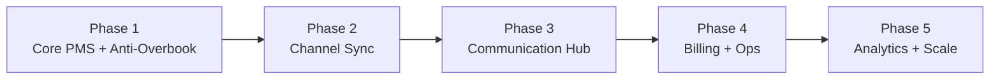

# 06 · Roadmap & MVP

ลำดับการพัฒนาแบบ **สร้างของที่ใช้ได้จริงเร็วที่สุด** แล้วต่อยอด — เริ่มจากแกนที่กัน overbooking ได้
ก่อน แล้วค่อยเพิ่มการเชื่อม OTA และการสื่อสาร

---

## ภาพรวมเฟส

---

## 🟢 Phase 1 — Core PMS + Anti-Overbooking (MVP)
**เป้าหมาย:** จองห้องได้ กัน overbooking ได้ เห็นปฏิทิน — พร้อมใช้จริงในโรงแรมเดียว

- [ ] Schema + migration (organization → property → room_type → room)
- [ ] Availability (inventory ระดับวัน) + `CHECK` กันเกิน
- [ ] Reservation Engine (transaction + `SELECT FOR UPDATE`)
- [ ] Rate & Rate Plan พื้นฐาน
- [ ] Admin: ปฏิทินห้องพัก + สร้าง/แก้/ยกเลิกจอง (manual)
- [ ] Auth + RBAC (Owner / Front Desk)
- [ ] Audit log

**เกณฑ์ผ่าน:** ยิงจอง 100 request พร้อมกันบนห้องสุดท้าย → ต้องสำเร็จแค่ 1, ไม่มี overbook

---

## 🟡 Phase 2 — Channel Sync
**เป้าหมาย:** เชื่อม OTA อัตโนมัติ (เริ่ม iCal → ต่อ Channel Manager)

- [ ] Channel Adapter interface + Direct Booking Adapter
- [ ] iCal Adapter (import poll + export feed) + idempotency ด้วย UID
- [ ] Channel mapping UI (room_type ↔ external room)
- [ ] Sync Worker (push availability/rate) + retry + sync_log
- [ ] Channel Manager Adapter (Channex sandbox) + webhook receiver
- [ ] Nightly reconciliation cron

**เกณฑ์ผ่าน:** จองตรง → OTA เห็นห้องลดภายในไม่กี่วินาที (CM) / รอบ poll (iCal)

---

## 🟠 Phase 3 — Communication Hub
**เป้าหมาย:** สื่อสารลูกค้าอัตโนมัติตลอด journey

- [ ] Message template (หลายภาษา) + renderer
- [ ] Automation rules engine (trigger + delay + condition)
- [ ] Dispatch worker + delayed queue
- [ ] ช่องทาง: Email ก่อน → LINE OA → SMS/WhatsApp
- [ ] Consent + opt-out + quiet hours (PDPA)
- [ ] Delivery tracking + metrics

**เกณฑ์ผ่าน:** จองใหม่ → ได้อีเมลยืนยันอัตโนมัติ + เตือนก่อนเช็คอิน 24 ชม.

---

## 🔵 Phase 4 — Billing & Operations
- [ ] Folio + folio items + payment (Omise/Stripe tokenization)
- [ ] เช็คอิน/เช็คเอาต์ flow + assign ห้องจริง
- [ ] Housekeeping board (สถานะห้อง + งานแม่บ้าน)
- [ ] Public Booking Engine (จองตรง ลดค่าคอมฯ OTA)

---

## 🟣 Phase 5 — Analytics & Scale
- [ ] Dashboard: occupancy, ADR, RevPAR, ช่องทางที่มา
- [ ] Multi-property / multi-currency เต็มรูปแบบ
- [ ] Dynamic pricing (ปรับราคาตาม demand)
- [ ] Inbox รวมสองทาง + FAQ bot

---

## KPI ของระบบ (ตัวชี้วัดความสำเร็จ)

| ด้าน | ตัวชี้วัด | เป้า |
|------|----------|------|
| Anti-overbook | จำนวน overbooking/เดือน | **0** |
| Sync | เวลา sync หลังจองตรง (CM) | < 5 วินาที |
| Sync | sync success rate | > 99.5% |
| Comms | delivery rate ข้อความยืนยัน | > 98% |
| Ops | เวลา onboard property ใหม่ | < 1 วัน |

---

## ศัพท์เฉพาะ (Glossary)

| คำ | ความหมาย |
|----|----------|
| **OTA** | Online Travel Agency (Airbnb, Booking.com...) |
| **PMS** | Property Management System (ระบบจัดการที่พัก) |
| **ARI** | Availability, Rates, Inventory (3 อย่างที่ sync กับ OTA) |
| **Channel Manager** | ตัวกลางเชื่อม PMS ↔ หลาย OTA |
| **Stop-sell** | สั่งหยุดขายห้องในวันที่กำหนด |
| **ADR / RevPAR** | Average Daily Rate / Revenue per Available Room |
| **Folio** | บัญชีค่าใช้จ่ายของการเข้าพัก |
| **CTA / CTD** | Closed to Arrival / Departure (ห้ามเช็คอิน/เอาต์วันนั้น) |

---

⬅️ กลับหน้าแรก: [README](../README.md)
