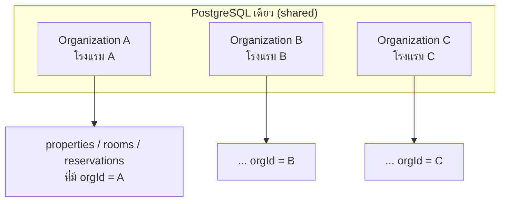
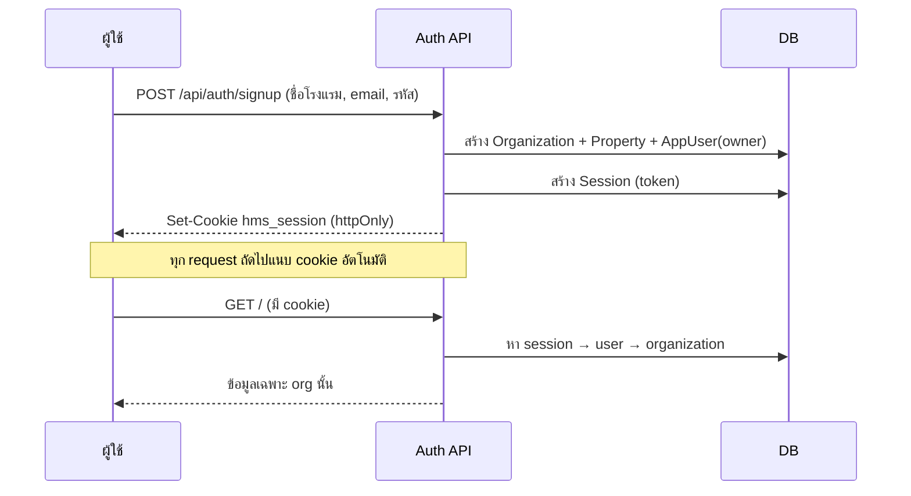
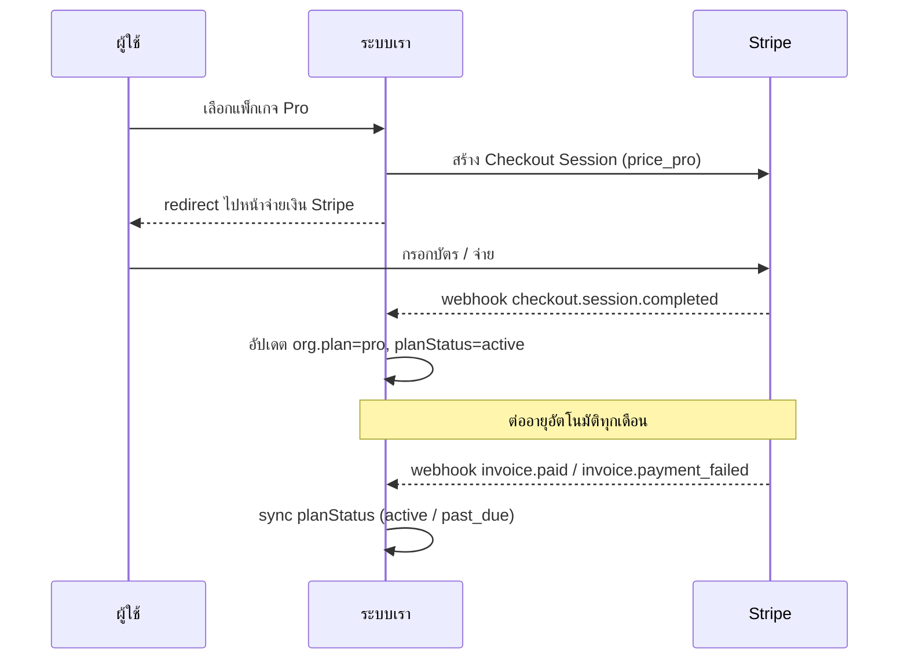

# 07 · SaaS: Multi-tenancy, Auth & Billing

ยกระดับจากระบบโรงแรมเดียว → **แพลตฟอร์มที่หลายโรงแรมสมัครใช้และจ่ายรายเดือน** (multi-tenant SaaS)
เอกสารนี้อธิบายโมเดล tenancy, ระบบสมาชิก, แพ็กเกจ และแผนต่อ Stripe

> ✅ ส่วน **Multi-tenant + Auth + Plans** implement แล้ว (ดู `lib/auth.ts`, `lib/plans.ts`, `middleware.ts`)
> ⬜ ส่วน **Stripe billing จริง** เป็นเฟสถัดไป (เอกสารนี้วางแบบไว้)

---

## 1. โมเดล Multi-tenancy

ใช้แบบ **Shared database, shared schema + tenant_id** (row-level isolation) — คุ้มค่าและ scale ดีสำหรับ SMB SaaS

- **`Organization` = tenant** (1 โรงแรม/เชน) — เป็น root ของข้อมูลทั้งหมด
- ทุก query **ต้องผูก `orgId`** ผ่าน session ปัจจุบัน → โรงแรม A ไม่มีทางเห็น/แตะข้อมูลโรงแรม B

### จุดบังคับ isolation (ในโค้ดจริง)
| จุด | การป้องกัน |
|-----|-----------|
| อ่านข้อมูล | ทุก `findMany` มี `where: { ...orgId }` หรือ `property: { orgId }` |
| สร้างการจอง | ตรวจ `property.orgId === session.orgId` **ก่อน**เข้า engine (ตอบ 403 ถ้าข้ามโรงแรม) |
| ยกเลิก/แก้ไข | ตรวจ resource เป็นของ org ตัวเองก่อนเสมอ |

> 🔒 ทดสอบแล้ว: โรงแรม B ยิง API จองห้องของโรงแรม A → ระบบตอบ **403** (กันข้าม tenant สำเร็จ)

---

## 2. ระบบสมาชิก (Authentication)

**Session-based auth** — opaque token เก็บใน DB (`Session`) + httpOnly cookie

- **รหัสผ่าน**: แฮชด้วย `scrypt` (node:crypto) + salt — ไม่พึ่ง native dependency
- **middleware.ts**: กันหน้าเว็บที่ยังไม่ล็อกอิน → redirect ไป `/login` (ตรวจ token จริงใน server component)
- **RBAC**: `role` = owner / manager / front_desk / housekeeping (เช่น เปลี่ยนแพ็กเกจได้เฉพาะ owner/manager)

---

## 3. แพ็กเกจ & Entitlements (Flat pricing)

นิยามที่ [`lib/plans.ts`](../lib/plans.ts) ที่เดียว → บังคับใช้ทั่วระบบ

| | **Starter** | **Pro** | **Enterprise** |
|--|-----------|---------|----------------|
| ราคา/เดือน | ฿990 | ฿2,900 | ฿7,900 |
| ห้องพัก | 15 | 80 | ไม่จำกัด |
| ที่พัก (property) | 1 | 3 | ไม่จำกัด |
| ผู้ใช้งาน | 3 | 15 | ไม่จำกัด |
| Channel Manager (OTA เรียลไทม์) | ✗ (iCal เท่านั้น) | ✓ | ✓ |

**การบังคับลิมิต** — เช่น เพิ่มห้องเกินแพ็กเกจ → ระบบตอบ **402 Payment Required** พร้อมชวนอัปเกรด
(ทดสอบแล้ว: Starter เพิ่มห้องเกิน 15 → ถูกปฏิเสธ)

**สถานะแพ็กเกจ** (`planStatus`): `trialing` (ทดลอง 14 วัน) → `active` (จ่ายแล้ว) → `past_due` / `canceled` (หมดสิทธิ์ใช้งาน)

---

## 4. แผนต่อ Stripe (เฟสถัดไป)

ตอนนี้เปลี่ยนแพ็กเกจได้แบบ **dev stub** (`/api/billing/plan` อัปเดต plan ตรงๆ ไม่ตัดเงิน)
เฟสถัดไปแทนที่ด้วย Stripe จริง:

**สิ่งที่ต้องทำ:**
1. สร้าง Product + Price ใน Stripe (map กับ `PLANS[x].stripePriceId`)
2. `/api/billing/checkout` → สร้าง Stripe Checkout Session
3. `/api/webhooks/stripe` → รับ event (ตรวจ signature) แล้ว sync `plan` / `planStatus`
4. Customer Portal (ให้ลูกค้าจัดการบัตร/ยกเลิกเอง)
5. Dunning — เมื่อ `invoice.payment_failed` → เตือน + ให้ grace period ก่อน `canceled`

**ฟิลด์ที่เตรียมไว้แล้วใน schema:** `stripeCustomerId`, `stripeSubscriptionId` (บน `Organization`)

---

## 5. สิ่งที่ต้องเตรียมก่อนเปิดขายจริง (Go-live checklist)

- [ ] ย้าย DB เป็น **PostgreSQL** + backup อัตโนมัติ (SQLite ใช้ dev เท่านั้น)
- [ ] Stripe live keys + merchant account (บริษัทจดทะเบียน)
- [ ] ออกใบกำกับภาษี **VAT 7%** ให้ลูกค้าโรงแรม
- [ ] **PDPA**: DPA (ในฐานะผู้ประมวลผลข้อมูลแทนโรงแรม), นโยบายความเป็นส่วนตัว, สิทธิ์ลบข้อมูล
- [ ] Terms of Service / SLA
- [ ] Super-admin dashboard (ดู MRR, churn, จัดการ tenant)
- [ ] Rate limiting + monitoring + error tracking
- [ ] Email verification ตอนสมัคร + reset password

---

## 6. Super-admin (แพลตฟอร์มของคุณ) — เฟสถัดไป

หน้าจอสำหรับ**เจ้าของแพลตฟอร์ม** (ไม่ใช่โรงแรม):
- รายชื่อ tenant ทั้งหมด + สถานะแพ็กเกจ
- MRR (รายได้ประจำเดือน), การเติบโต, churn rate
- ระงับ/เปิดใช้ tenant, ปรับแพ็กเกจ manual, ดู audit

---

⬅️ กลับ: [README](../README.md) · ดู [roadmap](06-roadmap.md)
